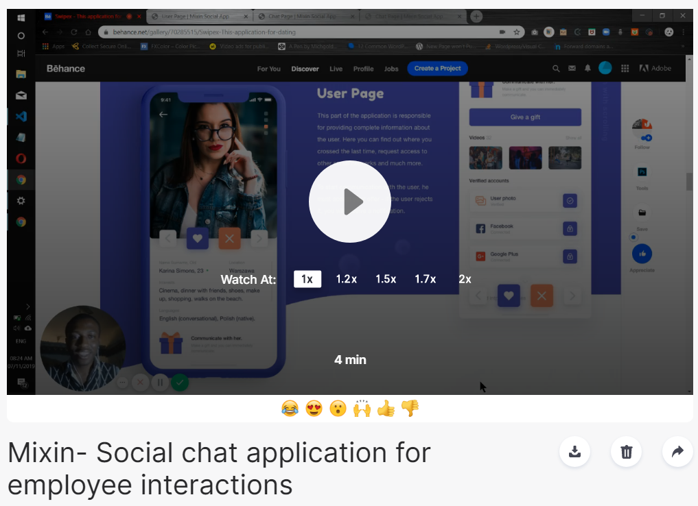

[![Issues][issues-shield]][issues-url]
[![MIT License][license-shield]][license-url]

# EMPLOYEE CHAT APP

 This is an Employee chat app [Front-End-Design]

 

  

  <h3 align="center">
  EMPLOYEE CHAT APP - Mixin
  </h3>

  <h3 align="center">
	 Live Version - https://mikenath223.github.io/Project-Capstone/
  </h3>

  

    This project is titled Mixin Social Chat App. which involves coding an already designed <a href="https://www.behance.net/gallery/70285515/Swipex-This-application-for-dating"> template </a> within a given timeframe.
     
    <a href="https://github.com/mikenath223/Project-Capstone/blob/master/README.md"><strong>Explore the docs 📚</strong></a>
     
     
	  🖊️
    <a href="https://www.behance.net/gallery/70285515/Swipex-This-application-for-dating">Assigment</a>
    🐱‍🚀
    <a href="https://github.com/mikenath223/Project-Capstone/issues">Report Bug</a>
    🙏
    <a href="https://github.com/mikenath223/Project-Capstone/issues">Request Feature</a>
  

# Screenshot

# Get Started
- Clone the repo to your local machine.
- Open the index.html file on your browser and use.

## Watch a video presentation of the project below.
Here is a video presentation of the project highlighting the features of it in terms of its responsiveness and other features.

  
   

# Built With
  - Passion for coding 💜
  - `HTML5`
  - `CSS3`

## Validations

- W3c Html validator - https://validator.w3.org/
- Stickler css linter

# Author
Ukeje Michgolden :man: - [Github profile](https://github.com/mikenath223)

* [LinkedIn](https://ng.linkedin.com/in/michgolden-ukeje-73b01614b)
* [Twitter](https://twitter.com/Michgolden_Nath)

# License

This project is licensed under the MIT License - see the [LICENSE](https://github.com/mikenath223/Project-Capstone/blob/master/LICENSE) file for details.

<!-- ACKNOWLEDGEMENTS -->
## Acknowledgements
* [Microverse](https://www.microverse.org/)
* [The Odin Project](https://www.theodinproject.com/)

<!-- MARKDOWN LINKS & IMAGES -->
<!-- https://www.markdownguide.org/basic-syntax/#reference-style-links -->
[issues-shield]: https://img.shields.io/github/issues/mikenath223/Project-Capstone
[issues-url]: https://github.com/mikenath223/Project-Capstone/issues
[license-shield]: https://img.shields.io/github/license/mikenath223/Project-Capstone
[license-url]: https://github.com/mikenath223/Project-Capstone/blob/master/LICENSE.txt
